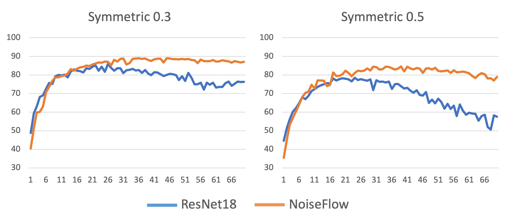
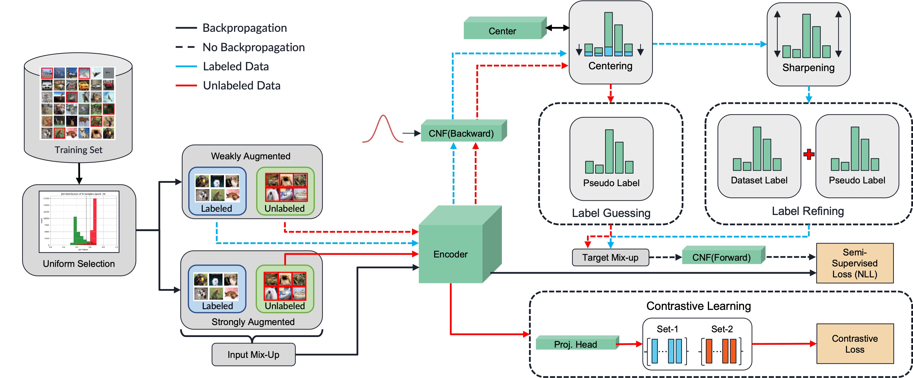
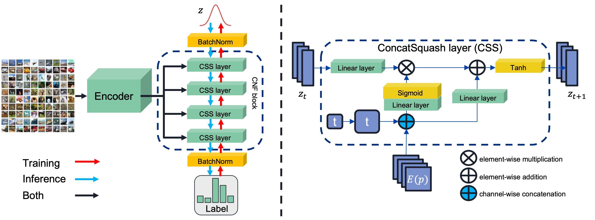
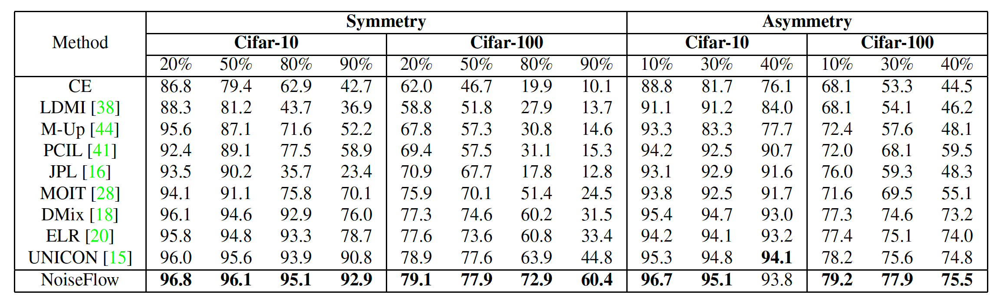
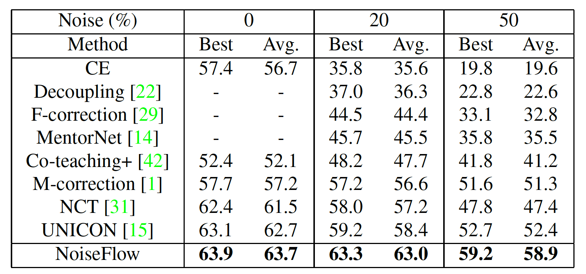

# NoiseFlow
PyTorch implementation  for NoiseFlow. For details, see `Let the Noise Flow Away: Combating Noisy Labels using Normalizing Flows`.

<br></br>
## Preliminary Experiment
<div align="center">
  
</div>
The preliminary experiment conducted on the Cifar-10 dataset. The results indicate that NFs can reduce the impact of noisy data. Note that in this particular experiment, we did not use any training techniques to address the issue of noisy labels.

<br></br>
## NoiseFlow framework
<div align="center">
  
</div>
The training of NoiseFlow involves four strategies: (1) mixup interpolation, (2) contrastive learning, (3) semi-supervised training, and (4) uniform selection.

<br></br>
## NoiseFlow Architecture
<div align="center">
  
</div>
The network architecture of NoiseFlow. (Left) During training, the conditional normalizing flow (CNF) block seeks to convert the encoded representations and label vectors into a standard normal distribution. During inference, the block employs noise vectors to generate the label distribution based on the representation. (Right) A detailed depiction of the ConcatSquash layer’s structure.

<br></br>
## Training
After creating a virtual environment, run
```bash
pip install -r requirements.txt
```

Training (CIFAR10 with 50% symmetric noise)
```bash
Train_flow.py  --noise_mode sym -r 0.5  --config ./config/cifar10.yaml
```

Training (CIFAR100 with 90% symmetric noise)
```bash
Train_flow.py  --noise_mode sym -r 0.9  --config ./config/cifar100.yaml
```

Training (TinyImageNet with 50% symmetric noise)
```bash
Train_flow.py -r 0.5 --config ./config/tinyImageNet.yaml
```


<br></br>
## Dataset
For datasets other than CIFAR10 and CIFAR100, you need to download them from their corresponsing website.
<br></br>
## Experiments
### cifar10 & cifar100
<div align="left">
  
</div>
The comparison of NoiseFlow with the baseline methods on the Cifar-10 and Cifar-100 datasets. We consider both symmetric and
asymmetric label noise as well as various noise ratios. For the baseline methods, we obtained their results from the published papers. The
numbers showed that our NoiseFlow model significantly outperformed the baseline methods in the majority of the experimental conditions.

<br></br>
### TinyImageNet
<div align="left">
  
</div>
We compare NoiseFlow with baseline methods on Tiny-
Image under simulated symmetric noise conditions. Both the highest
and average accuracy values on the testing set are reported.

<br></br>
## Citation
If you find this repository useful, please consider giving a star ⭐